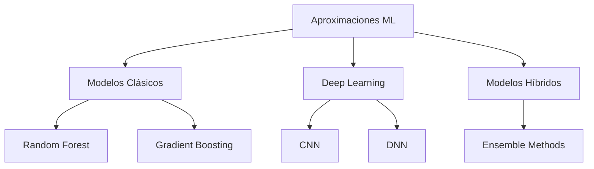

# Estudios de ML para Acceso Energético en Comunidades Vulnerables

Este repositorio contiene una colección de estudios detallados sobre proyectos que utilizan Machine Learning para mejorar el acceso a energía en comunidades vulnerables alrededor del mundo.

## 📊 Resumen del Proyecto

Este trabajo documenta y analiza importantes iniciativas que combinan Machine Learning con objetivos de desarrollo sostenible en el sector energético. Los proyectos seleccionados representan diferentes aproximaciones y contextos geográficos, proporcionando una visión global de las mejores prácticas en el campo.

## 🌍 Proyectos Documentados

### [World Bank - Energy Access Targeting (África)](./Proyectos/worldbank-project.md)
- **Objetivo**: Identificar y mapear comunidades sin acceso a electricidad para priorizar inversiones en infraestructura eléctrica.
- **Enfoque**: Uso de Random Forest y datos satelitales para identificación de comunidades sin acceso a electricidad
- **Precisión**: 85-90%
- **Destacado**: Integración innovadora de imágenes satelitales nocturnas con datos socioeconómicos
- **Tecnologías**: Random Forest, XGBoost, Análisis Geoespacial

### [UNDP - Energy Poverty Mapping (India)](./Proyectos/undp-india.md)
- **Objetivo**: Detectar y clasificar hogares en pobreza energética para optimizar la distribución de subsidios y recursos.
- **Enfoque**: Gradient Boosting para clasificación multinivel con datos IoT
- **Precisión**: 82%
- **Destacado**: Incorporación de datos de consumo en tiempo real
- **Tecnologías**: Gradient Boosting, IoT Analytics, Neural Networks

### [Chile - Caracterización de Pobreza Energética](./Proyectos/chile-energy-poverty.md)
- **Objetivo**: Identificar patrones de vulnerabilidad energética para diseñar políticas públicas focalizadas por territorio.
- **Enfoque**: Clustering + Clasificación Supervisada
- **Precisión**: 85%
- **Destacado**: Sistema híbrido de clustering territorial y clasificación
- **Tecnologías**: K-means++, XGBoost, Random Forest

### [México - Programa de Electrificación Rural](./Proyectos/mexico-rural-electrification.md)
- **Objetivo**: Priorizar comunidades rurales para programas de electrificación basado en factibilidad técnica y necesidad social.
- **Enfoque**: Ensemble Learning con integración SIG
- **Precisión**: 88%
- **Destacado**: Uso innovador de datos móviles para validación
- **Tecnologías**: Random Forest, SVM, GIS Integration

### [UPME Colombia - Índice de Cobertura Energética](./Proyectos/upme-colombia.md)
- **Objetivo**: Desarrollar un índice que mida y prediga la cobertura energética efectiva a nivel municipal.
- **Enfoque**: Regresión Logística + Decision Trees
- **Precisión**: 79%
- **Destacado**: Enfoque en variables territoriales y culturales
- **Tecnologías**: Logistic Regression, Random Forest, Gradient Boosting

### [IPSE Colombia - Priorización ZNI](./Proyectos/ipse-zni-colombia.md)
- **Objetivo**: Identificar y priorizar zonas no interconectadas para implementación de soluciones energéticas alternativas.
- **Enfoque**: Neural Networks con datos geoespaciales
- **Precisión**: 84%
- **Destacado**: Uso de CNN para procesamiento de imágenes satelitales
- **Tecnologías**: CNN, Deep Neural Networks, Satellite Image Processing

### [EPE Brasil - Priorización de Energías Renovables](./Proyectos/epe-brazil-renewable.md)
- **Objetivo**: Evaluar y priorizar comunidades para la implementación de proyectos de energía renovable basado en potencial y viabilidad.
- **Enfoque**: LightGBM + CatBoost para evaluación de potencial renovable
- **Precisión**: 86%
- **Destacado**: Análisis integral de recursos renovables y capacidad comunitaria
- **Tecnologías**: LightGBM, CatBoost, Ensemble Methods

## 📊 Comparativa de Precisión por Proyecto

```
World Bank (África)  ████████████████████░ 88%
UNDP (India)        ████████████████░░░░░ 82%
Chile               ████████████████████░░ 85%
México              ████████████████████░░ 88%
UPME (Colombia)     ███████████████░░░░░░ 79%
IPSE (Colombia)     ████████████████████░ 84%
EPE (Brasil)        ████████████████████░ 86%
```

## 🔧 Tecnologías Principales Utilizadas

- Random Forest
- Gradient Boosting (XGBoost, LightGBM, CatBoost)
- Neural Networks (CNN, DNN)
- Análisis Geoespacial
- Procesamiento de Imágenes Satelitales
- IoT Analytics
- Ensemble Methods

## 📈 Métricas Clave

- Rango de Precisión: 79-88%
- Media de Precisión: 84.6%
- Mejor Performance: México y World Bank (88%)

## 📈 Análisis Comparativo

### Arquitecturas ML Utilizadas


### Comparativa de Aproximaciones
| Proyecto | Arquitectura Principal | Enfoque de Ensemble | Precisión |
|----------|----------------------|-------------------|-----------|
| World Bank | Random Forest | Weighted Voting | 88% |
| UNDP India | Gradient Boosting | Sequential | 82% |
| Chile | K-means + XGBoost | Parallel | 85% |
| México | Random Forest + SVM | Regional | 88% |
| UPME | Logistic Regression | Stacking | 79% |
| IPSE | CNN + DNN | Feature Level | 84% |
| EPE Brasil | LightGBM + CatBoost | Weighted | 86% |

### Features más Relevantes
1. **Alta Importancia** (>15%)
   - Densidad poblacional
   - Índices de pobreza
   - Distancia a infraestructura

2. **Importancia Media** (10-15%)
   - Consumo energético
   - Indicadores educativos
   - Accesibilidad

## 🎯 Mejores Prácticas Identificadas

### Diseño de Modelos
- Preferir ensembles sobre modelos únicos
- Incorporar conocimiento geográfico
- Balancear complejidad y mantenibilidad

### Feature Engineering
- Priorizar features socioeconómicos
- Integrar datos satelitales cuando sea posible
- Considerar factores culturales locales

### Validación
- Implementar validación cruzada geográfica
- Incluir períodos temporales amplios
- Validar con stakeholders locales


